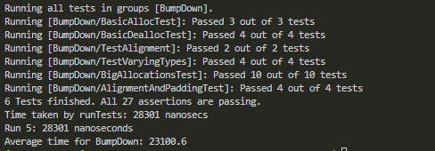
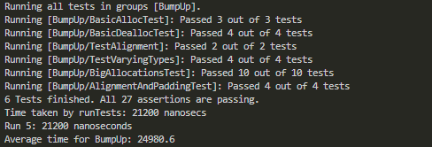
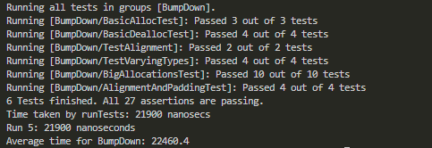

# ASP Worksheet 2
## Task 1

For task 1 we were asked to implement a bump allocator with methods to alloc and dealloc. The allocator creates a heap of the specified size on creation and will return a pointer for the allocation of the data type being allocated. If there is not enough memory for an allocation it will return a nullptr. The allocator has an allocation count to keep track of the number of allocations. When dealloc is called the allocation count will be decremented. When the allocation count reaches 0, the next pointer is reset so that the heap memory is available for allocations.

To create an instance of the allocator: BumpAllocator<Size(In bytes)> allocator and then to allocate using allocator.alloc<(datatype)>(numObjects).

### Task 1 member functions

alloc - Allocates memory for object(s). It is a template function so can take different data types, the number of objects to allocate can be specified, otherwise the default is 1.

dealloc - Decrements the allocation counter unless the count has reached 0, whereas the next pointer will be reset so that the heap memory is available to allocate again.

getPtrPosition - Returns the position of the next pointer which points to the boundary of the used and unused memory.

The allocator uses template functions so that it can handle different data types and is type safe.
### Task 1 tests
To test the functionality of the allocator I wrote a few basic tests and asserted that the values were correct.

testBasicAllocation - Creates a bump allocator instance with a KB of memory and allocates memory for an integer and a double and asserts that the returned pointers are not null.

testMemoryExhaustion - Creates a bump allocator with a small amount of memory (64 bytes) to demonstrate that the allocation method will return a nullptr if there is not enough memory to allocate more objects.

testAlignment - Creates a bump allocator with a KB of memory and allocates a couple of different data types and asserts that when they are allocated the memory address is correctly aligned e.g an int has an alignment requirement of 4 so there should be no remainder if when divided by alignof(int). Making sure that the heap is properly aligned is important as it can lead to increased CPU read cycles.

testDeallocation - Creates an allocator instance with 1KB memory. Allocates memory to 3 objects of varying types and then dealloc is called 3 times which should reset the ptr position back to the start of the heap. Asserts that the pointer is at the correct position. To further insure that the allocator is performing as intended, allocate memory for 10 ints and assert that the pointer is again in the correct position.

testPaddingAndAlignment - To test that objects are being aligned correctly in memory and that padding is being calculated correctly. It creates an allocator instance then allocates objects of different types and alignments then calculates the padding based on the ptr position values. If the padding is within expected range then the allocator is performing correctly.

## Task 2
For task 2 we were asked to use the simpletest framework to write unit tests for our bump allocator. I adapted most of the tests that I had written for task 1 to use simpletest instead of cassert and added some others.

### Task 2 tests

- BasicAllocTest - In this test the allocator is given space for 20 ints on the heap and 30 ints are allocated, 10 at a time to test that the returned ptr is valid unless there is not enough space to allocate to more objects. The allocator should fail to allocate the last 10 ints.

- BasicDeallocTest - This test is almost identical to testDeallocation used in task 1, but modified to use the simpletest framework. Creates an allocator instance with 1KB memory. Allocates memory to 3 objects of varying types and then dealloc is called 3 times which should reset the ptr position back to the start of the heap. Asserts that the pointer is at the correct position. To further insure that the allocator is performing as intended, allocate memory for 10 ints and assert that the pointer is again in the correct position.

- TestAlignment - Creates a bump allocator with a KB of memory and allocates a couple of different data types and asserts that when they are allocated the memory address is correctly aligned e.g an int has an alignment requirement of 4 so there should be no remainder if when divided by alignof(int).

- TestVaryingTypes - In this test the allocator is given 4KB of memory to allocate. It is then given the task of allocating exactly 4KB of memory to objects of varying sizes to see if there are any errors. There should not be any padding used as based on the data types being allocated memory, the heap should always be aligned correctly in this case. This test is to ensure that the allocator can handle allocations of varying types and sizes and that no unnecessary padding is added when it is not needed.

- BigAllocationsTest - To test that the allocator can handle larger allocations. Allocator is given 1MB of memory (mebibyte if you want to be a nerd) and allocates 10KB of memory at a time and asserts that the allocations have not failed.

- AlignmentAndPaddingTest - To test that objects are being aligned correctly in memory and that padding is being calculated correctly. It creates an allocator instance then allocates objects of different types and alignments then calculates the padding based on the ptr position values. If the padding is within expected range then the allocator is performing correctly.

## Task 3
For task 3 we were asked to implement an allocator which bumps down as an alternative to our prior implementation which bumped up. Based on the blog post provided on the worksheet bumping down should be more efficient due to generating fewer lines of source code when compiled as well as using fewer registers than the bump up allocator. How true this will turn out to be for my code is provided in the benchmark results below.

To measure the speed of execution based on the tests written for the previous task, I used variadric templates as suggested on the worksheet to create a benchmark function which would calculate the time it took for a function to execute. I also created another function "report_time" which would call the "benchmark" function to record the time and then output the execution time to the command line. In hindsight this probably could just be 1 combined function. 

The code I used to benchmark the two allocator types is in benchmark.cpp. Each allocator is timed executing the previously written tests 5 times and an average time calculated to get a more fair result. The test code for the AlignmentAndPaddingTest is slightly modified for the bumpdown allocator but the only change is the order in which the allocations are made so this should not unfairly affect the results. For the first set of results the optimisation level was set to O2 and the second set to O3 to see if there was an observable difference.

### O2 Optimisation level output
#### Bumping Up results - Average execution time: 21760 nanoseconds

#### Bumping Down results - Average execution time: 23100.6 nanoseconds

### O3 Optimisation level output
#### Bumping Up results - Average execution time: 24980.6 nanoseconds

#### Bumping Down results - Average execution time: 22460.4 nanoseconds 

### Evaluation of results

Surprisingly the fastest average execution (though over a small sample), was the BumpUp allocator on the lower optimisation setting. This is not the logical outcome that one might expect but based on what I have observed over the course of working on this worksheet is that the times can vary quite substantially. Overall across all the benchmark results the times were very close together with variation across the averages of less than 4 microseconds.